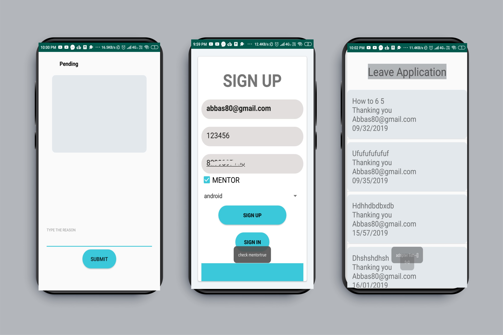
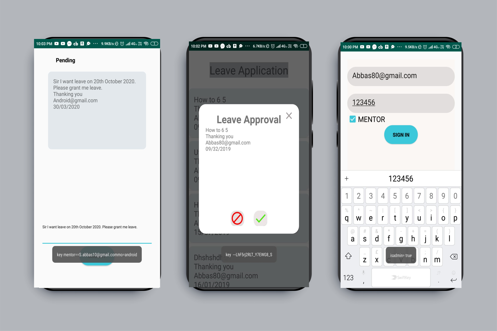

# Leave_Approval_Application

A leave approval application for the Club Innogeeks which enable mentors of different domains to grant the leave to thier respective students or club members.
Flow:

1: Student selects the domain and send the leave application.

2: Notification is popped on the mentor mobile, now he/she either accepts the application or reject the application.

3: Student is notified of the action taken by the mentor to his/her leave Application. 

4: All this is done by maintaining the user database of students and mentors.
